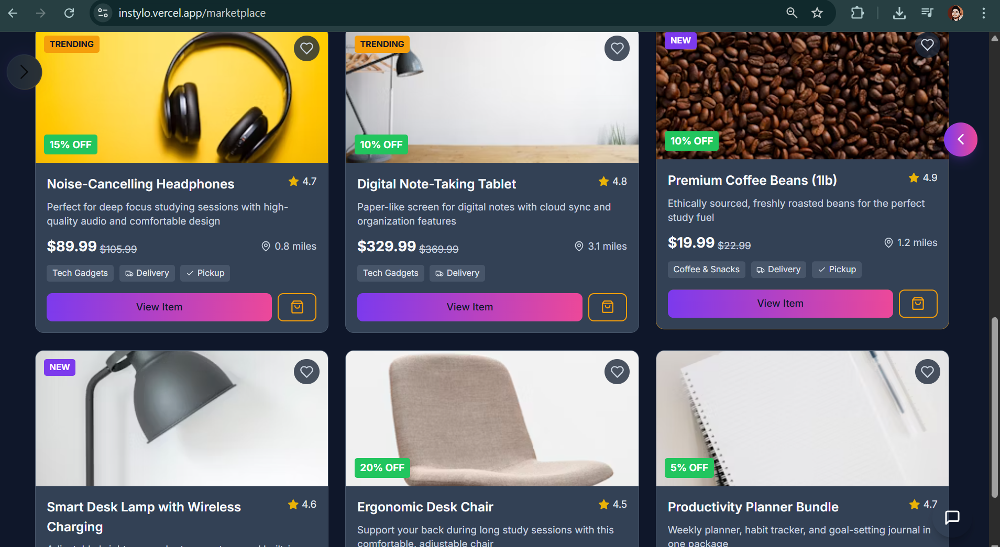

<div align="center">
  
  
  # INSTYLO
  
  <p align="center">
    <a href="#features"> Features</a> •
    <a href="#tech-stack"> Tech Stack</a> •
    <a href="#getting-started"> Get Started</a> •
    <a href="#showcase"> Showcase</a> •
    <a href="#team"> Team</a> •
    <a href="#future-roadmap"> Roadmap</a>
  </p>
  
  
  
  
  
  
  <br/>
  
  <em>Experience the next generation of social connectivity and learning!</em>
  <br/><br/>
</div>
<br/>

## ✨ Next-Gen Social Platform

Instylo redefines social media by combining powerful networking features with innovative learning tools, community building, and entertainment - all in one sleek platform designed for the future.

<div align="center">
  <hr style="width:100%; border:0; height:2px; background-color:#f0f0f0; margin: 30px 0;">
</div>

## Features

<table>
  <tr>
    <td width="50%">
      <h3 align="center">🌐 Social Networking</h3>
      <div align="center">
        <a href="#"></a>
        <p>Create and share content, engage with others through likes and comments, and build your personal profile.</p>
      </div>
    </td>
    <td width="50%">
      <h3 align="center">🎮 Game Center</h3>
      <div align="center">
        <a href="#"></a>
        <p>Access a curated collection of free games with advanced filtering and search functionality.</p>
      </div>
    </td>
  </tr>
  <tr>
    <td width="50%">
      <h3 align="center">🧠 Study Buddy System</h3>
      <div align="center">
        <a href="#"></a>
        <p>Connect with AI-powered study companions and track your learning progress across subjects.</p>
      </div>
    </td>
    <td width="50%">
      <h3 align="center">📰 News Feed</h3>
      <div align="center">
        <a href="#"></a>
        <p>Stay updated with categorized news and save articles for later reading.</p>
      </div>
    </td>
  </tr>
  <tr>
    <td width="50%">
      <h3 align="center">🎯 Communities</h3>
      <div align="center">
        <a href="#"></a>
        <p>Join specialized groups tailored to your interests and connect with like-minded individuals.</p>
      </div>
    </td>
    <td width="50%">
      <h3 align="center">🎥 Video Conferencing</h3>
      <div align="center">
        <a href="#"></a>
        <p>Create or join video call rooms to connect with friends, family, or study groups.</p>
      </div>
    </td>
  </tr>
  <tr>
    <td width="50%">
      <h3 align="center">🛒 Marketplace</h3>
      <div align="center">
        <a href="#"></a>
        <p>Browse products, earn reward points, and access special discounts and offers.</p>
      </div>
    </td>
    <td width="50%">
      <h3 align="center">🤝 Services</h3>
      <div align="center">
        <a href="#"></a>
        <p>Discover volunteer opportunities and service activities to contribute to your community.</p>
      </div>
    </td>
  </tr>
</table>


## Tech Stack

<div align="center">
  <table>
    <tr>
      <td align="center" width="96">
        <a href="#">
          
        </a>
        <br>React
      </td>
      <td align="center" width="96">
        <a href="#">
          
        </a>
        <br>TypeScript
      </td>
      <td align="center" width="96">
        <a href="#">
          
        </a>
        <br>Tailwind
      </td>
      <td align="center" width="96">
        <a href="#">
          
        </a>
        <br>React Query
      </td>
      <td align="center" width="96">
        <a href="#">
          
        </a>
        <br>Vite
      </td>
      <td align="center" width="96">
        <a href="#">
          
        </a>
        <br>Appwrite
      </td>
    </tr>
    <tr>
      <td align="center" width="96">
        <a href="#">
          
        </a>
        <br>Vercel
      </td>
      <td align="center" width="96">
        <a href="#">
          
        </a>
        <br>Framer
      </td>
      <td align="center" width="96">
        <a href="#">
          
        </a>
        <br>Node.js
      </td>
      <td align="center" width="96">
        <a href="#">
          
        </a>
        <br>Jitsi Meet
      </td>
      <td align="center" width="96">
        <a href="#">
          
        </a>
        <br>NewsAPI
      </td>
      <td align="center" width="96">
        <a href="#">
          
        </a>
        <br>RapidAPI
      </td>
    </tr>
  </table>
</div>

## Getting Started

### Prerequisites

- Node.js and npm
- Git

<details>
<summary>👇 Click to expand installation steps</summary>

### 1. Clone the Repository

```bash
git clone https://github.com/shkshreyas/instylo
cd instylo
```

### 2. Install Dependencies

```bash
npm install
```

### 3. Set Up Environment Variables

Create a `.env` file in the root directory and add:

```env
VITE_APPWRITE_URL=
VITE_APPWRITE_PROJECT_ID=
VITE_APPWRITE_DATABASE_ID=
VITE_APPWRITE_STORAGE_ID=
VITE_APPWRITE_USER_COLLECTION_ID=
VITE_APPWRITE_POST_COLLECTION_ID=
VITE_APPWRITE_SAVES_COLLECTION_ID=
VITE_NEWSAPI_KEY=
VITE_RAPIDAPI_KEY=
VITE_GEMINI_API_KEY=
VITE_WEATHER_API_KEY=
VITE_DEFAULT_TONE='friendly'
VITE_DEFAULT_LANGUAGE='en'
VITE_ENABLE_VOICE=true
VITE_ENABLE_WEATHER=true
```

### 4. Run the Project

```bash
npm run dev
```

</details>

<div align="center">
  <a href="https://instylo.vercel.app" target="_blank"></a>
</div>

<div align="center">
  <hr style="width:100%; border:0; height:2px; background-color:#f0f0f0; margin: 30px 0;">
</div>

## Showcase

<div align="center">
  
  <p>Fully responsive across all devices</p>
</div>

### 🌟 Feature Showcase

<details open>
<summary><b>📱 Dashboard & Social Features</b></summary>
<div align="center" style="margin-top: 20px;">
  
  <p><i>Home Dashboard with Feed and Trending Content</i></p>
  
  
  <p><i>Explore and Search Functionality</i></p>
</div>
</details>

<details>
<summary><b>👥 Communities & Connections</b></summary>
<div align="center" style="margin-top: 20px;">
  
  <p><i>Community Hubs and Group Interactions</i></p>
  
  
  <p><i>Real-time Video Conferencing</i></p>
</div>
</details>

<details>
<summary><b>🧠 Learning & Information</b></summary>
<div align="center" style="margin-top: 20px;">
  
  <p><i>Categorized News with Save and Search Features</i></p>
  
  
  <p><i>AI-Powered Learning Assistant</i></p>
</div>
</details>

<details>
<summary><b>🎮 Entertainment & Commerce</b></summary>
<div align="center" style="margin-top: 20px;">
  
  <p><i>Games Center with Filtering and Categories</i></p>
  
  
  <p><i>Marketplace Overview</i></p>
  
  
  <p><i>Detailed Product Views and Reward System</i></p>
</div>
</details>


## Team

<div align="center">
  <table>
    <tr>
      <td align="center">
        <a href="https://github.com/shkshreyas">
          
          <br />
          <sub><b>Shreyas Kumar</b></sub>
        </a>
        <br />
        <a href="https://github.com/shkshreyas" title="GitHub"></a>
        <a href="https://www.linkedin.com/in/shkshreyas" title="LinkedIn"></a>
        <br />
        <sub>Full Stack Developer</sub>
      </td>
      <td align="center">
        <a href="https://github.com/shivanyadutta">
          
          <br />
          <sub><b>Shivanya Shomir Dutta</b></sub>
        </a>
        <br />
        <a href="https://github.com/shivanyadutta" title="GitHub"></a>
        <a href="https://www.linkedin.com/in/shivanya-dutta-6a0870281" title="LinkedIn"></a>
        <br />
        <sub>UI/UX Designer</sub>
      </td>
      <td align="center">
        <a href="https://github.com/sahilsandeep2005">
          
          <br />
          <sub><b>Sahil Sandeep</b></sub>
        </a>
        <br />
        <a href="https://github.com/sahilsandeep2005" title="GitHub"></a>
        <a href="https://www.linkedin.com/in/sahil-sandeep-a9961628a" title="LinkedIn"></a>
        <br />
        <sub>Backend Developer</sub>
      </td>
    </tr>
  </table>
</div>


## Future Roadmap

<table>
  <tr>
    <td>
      
    </td>
    <td>
      <h3>Real-time Features</h3>
      <ul>
        <li>Live chat system with end-to-end encryption</li>
        <li>Real-time notifications for interactions</li>
        <li>Collaborative document editing</li>
      </ul>
    </td>
  </tr>
  <tr>
    <td>
      
    </td>
    <td>
      <h3>AI Enhancements</h3>
      <ul>
        <li>Personalized content recommendations</li>
        <li>Advanced AI study companions</li>
        <li>Automated content moderation</li>
      </ul>
    </td>
  </tr>
  <tr>
    <td>
      
    </td>
    <td>
      <h3>Mobile Apps</h3>
      <ul>
        <li>Native iOS and Android applications</li>
        <li>Push notifications system</li>
        <li>Offline content access</li>
      </ul>
    </td>
  </tr>
  <tr>
    <td>
      
    </td>
    <td>
      <h3>Enhanced Analytics</h3>
      <ul>
        <li>Learning analytics dashboard</li>
        <li>Personalized usage statistics</li>
        <li>Community engagement metrics</li>
      </ul>
    </td>
  </tr>
</table>

<div align="center">
  
  <h2>We'd love your feedback and contributions!</h2>
  <p>Feel free to open issues, submit pull requests, or reach out to the team.</p>
  
  <br/>
  
  <a href="https://github.com/shkshreyas/instylo/issues">Report Bug</a>
  ·
  <a href="https://github.com/shkshreyas/instylo/issues">Request Feature</a>
  ·
  <a href="mailto:shkshreyaskumar@gmail.com">Contact Us</a>
  
  <br/><br/>
  
  
</div>

<div align="center">
  <br/>
  <p>© 2025 Instylo. All rights reserved.</p>
</div>
